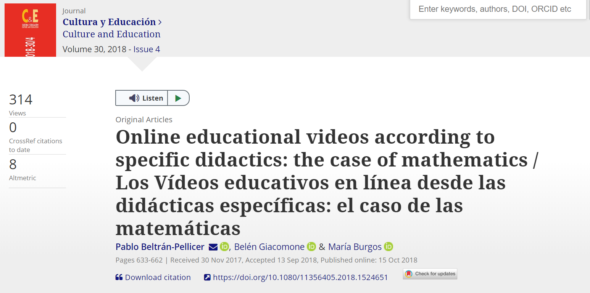
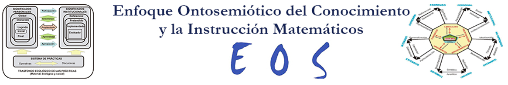
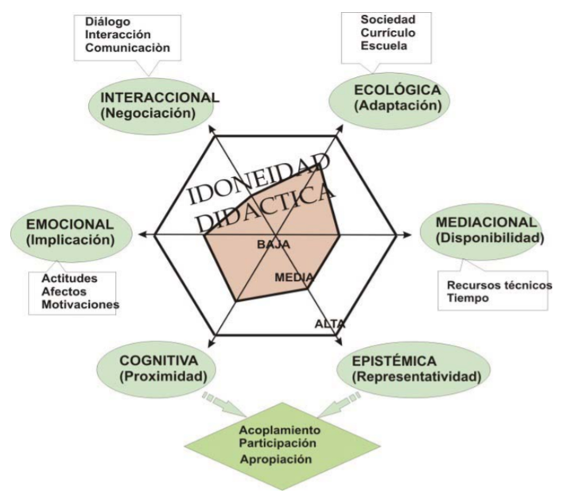
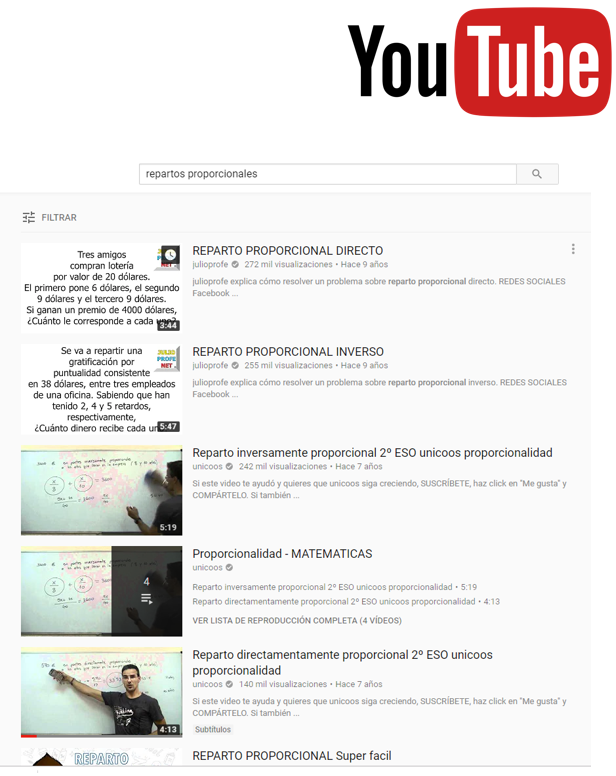
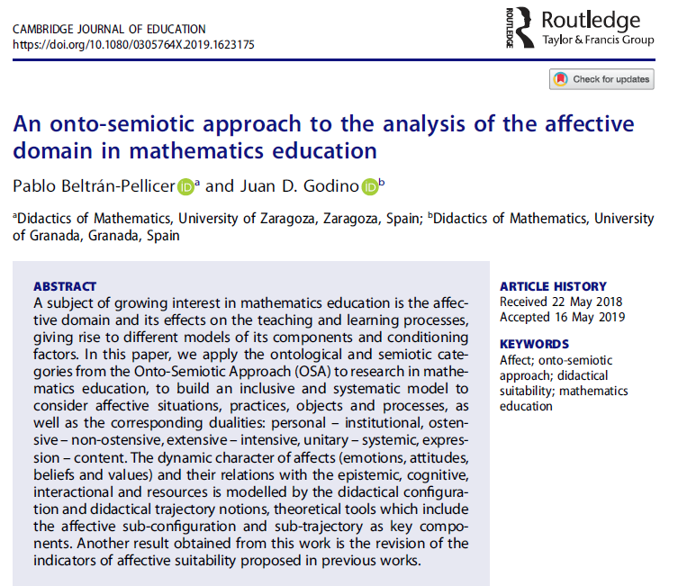
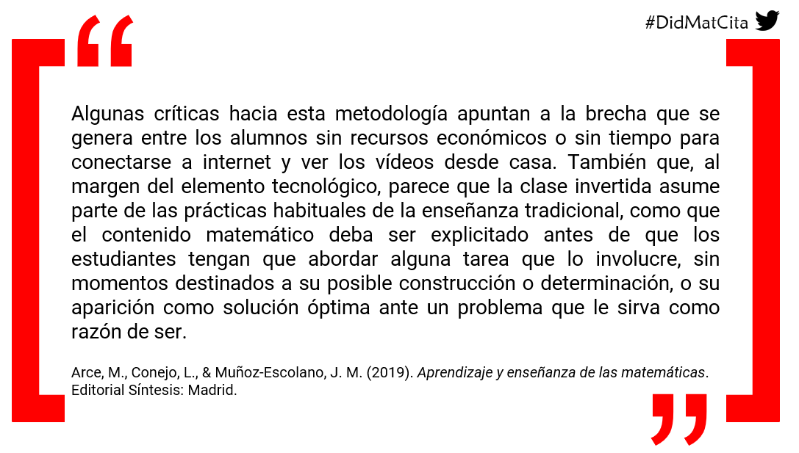

# Acceso a la presentación {data-background-image="assets/images/pc.jpg" data-background-opacity="0.25"}

## {data-background-image="assets/images/pc.jpg" data-background-opacity="0.18"}

{width=60%}

[https://pbeltran.github.io/unaempresadocente-videos](https://pbeltran.github.io/unaempresadocente-videos)

# ¿Por qué interesarnos en esto? {data-background-image="assets/images/videos1.jpg" data-background-opacity="0.18"}

##

- El fenómeno de los vídeos educativos alojados en plataformas en línea no es nuevo.
- YouTube™ es aceptado por los estudiantes como medio para el aprendizaje de las matemáticas (Ramírez, 2010). 
- Estos vídeos son un recurso muy utilizado en ciertas propuestas pedagógicas, como en el **flipped learning** (Davies, Dean, & Ball, 2013).

##

> Es necesario que las **didácticas específicas** indaguen sobre el grado de adecuación de estas propuestas de enseñanza-aprendizaje, asegurando de esta forma que la tecnología esté alineada con los objetivos de aprendizaje (Turney, Robinson, Lee, & Soutar, 2009)

# Un estudio sobre vídeos de YouTube {data-background-image="assets/images/videos1.jpg" data-background-opacity="0.18"}

##

Beltrán-Pellicer, P., Giacomone, B., & Burgos, M. (2018). Online educational videos according to specific didactics: the case of mathematics / Los vídeos educativos en línea desde las didácticas específicas: el caso de las matemáticas. _Cultura y Educación, 30_(4), 633-662. doi: 10.1080/11356405.2018.1524651.

[Enlace](https://www.tandfonline.com/eprint/r8gbHE2dM75Z3t3wdE7U/full) [Enlace a RG](https://www.researchgate.net/publication/328292739_Online_educational_videos_according_to_specific_didactics_the_case_of_mathematics_Los_Videos_educativos_en_linea_desde_las_didacticas_especificas_el_caso_de_las_matematicas/comments)

{width=50%}

## Objetivo del trabajo

En este estudio se describe y se interpreta la **faceta epistémica** de videos educativos en línea previamente seleccionados, teniendo como objetivo general valorar el grado de adecuación epistémica de los vídeos más vistos por los usuarios en YouTube™.

## Marco teórico y metodología

:::incremental
- **Metodología cualitativa**, de carácter interpretativo-valorativo.
- Herramientas teórico-metodológicas del **enfoque ontológico-semiótico del conocimiento y la instrucción matemáticos (EOS)** (Godino, Batanero, & Font, 2007).
:::

. . .

{width=90%}
[http://enfoqueontosemiotico.ugr.es](http://enfoqueontosemiotico.ugr.es/)

## Idoneidad didáctica

Grado en que un proceso de instrucción reúne ciertas características que permiten calificarlo como adecuado para la adaptación entre los significados personales obtenidos por los alumnos (aprendizaje) y los significados institucionales, ya sean pretendidos o implementados (enseñanza), considerando la influencia del entorno (Godino, 2013). 

## Idoneidad didáctica

{width=65%}

Fuente: Godino (2013).

## Criterios de idoneidad
:::incremental
- Para cada faceta Godino (2013) propone un sistema de criterios generales para que sean consideradas de calidad. 
- Breda, Pino-Fan, & Font (2017) señalan que estos criterios de idoneidad didáctica son potentes herramientas para organizar la reflexión y evaluación de un proceso de instrucción.
	- Es conveniente utilizarlos para analizar y valorar los vídeos de la muestra considerada. 
- Santos (2018) propone un modelo para valorar vídeos educativos de matemáticas:
	- Idoneidad didáctica (EOS).
	- Lógica difusa para considerar la evaluación mediante una opinión de las comunidades de interés
	- Métodos multicriterio (TOPSIS), para ordenar los datos obtenidos y tomar decisiones a partir de ellos.
:::

## Faceta epistémica

:::incremental
- La faceta epistémica se refiere, en términos de Breda et al., (2017) a la enseñanza de una buena matemática.
- La idoneidad epistémica se considera mayor en la medida que los contenidos pretendidos o implementados representan bien a los contenidos de referencia. Dos criterios fundamentales (Godino, 2013):
	- La presencia de diversos significados del contenido correspondiente y su interconexión.
	- El reconocimiento de la diversidad de objetos primarios y procesos implicados para los diversos significados.
:::

## Faceta epistémica
Las situaciones-problemas tienen un rol central en el EOS, de modo que los objetos matemáticos participan y emergen de los sistemas de prácticas matemáticas.
Bajo esta perspectiva ontosemiótica, la actividad matemática se puede describir y analizar a partir de una tipología explícita de objetos (Godino et al., 2007):
Lenguajes (en sus diversos registros y representaciones, natural, gestual, simbólico, gráfico, etc.).
Situaciones-problemas (aplicaciones intra y extra-matemáticas, ejercicios, problemas).
Reglas:
Conceptos-definición (conceptos introducidos mediante definiciones o descripciones, proporcionalidad, función, etc.).
Proposiciones (enunciados sobre conceptos-definición).
Procedimientos (algoritmos, operaciones, técnicas de cálculo).
Argumentos (enunciados usados para validar o explicar las proposiciones y procedimientos).

## Objeto matemático de estudio
>Repartos directamente proporcionales.

Este tipo de situación-problema aparece en el primer ciclo de educación secundaria en España, dentro del bloque dedicado a 'Números y álgebra' de la LOMCE.
Las concreciones curriculares autonómicas lo incluyen en 2º ESO (13-14 años).
La proporcionalidad es un tema recurrente en los canales de YouTube™.
Modelo de razonamiento algebraico escolar (EOS):
Niveles de algebrización de las prácticas matemáticas que se realizan al resolver tareas propias de Educación Primaria y Secundaria (Godino, Aké, Gonzato, & Wilhelmi, 2014; Godino, Neto, Wilhelmi, Aké, Etchegaray, & Lasa, 2015). 
Se definen a partir de los tipos de representaciones usadas, los procesos de generalización implicados y el cálculo analítico que se pone en juego en la actividad matemática correspondiente (los tres primeros niveles que son suficientes para nuestro trabajo).

## Niveles de algebrización

{width=65%}

## Muestra
:::::::::::::: {.columns}

::: {.column width="55%"}
:::incremental
- Una búsqueda por vídeos en YouTube™ con las palabras clave repartos proporcionales devuelve 1370 resultados. 
- Seleccionamos solamente aquellos con más de 1000 visitas.
- Se reduce el conjunto a 60 vídeos. De ellos, la mitad tratan exclusivamente repartos inversamente proporcionales o compuestos, de manera que la muestra final de estudio queda determinada por 31 vídeos.
:::

:::

::: {.column width="45%"}

{width=80%}

:::
::::::::::::::

# Dominio afectivo

## La faceta afectiva

La faceta afectiva de un proceso de enseñanza y aprendizaje de las matemáticas es una de las complejas.

:::incremental
- Interacción con la faceta cognitiva.
- Objeto de investigación desde diferentes marcos teóricos. 
- Consenso en distinguir emociones, actitudes y creencias (McLeod, 1992). 
- Es habitual considerar también los valores (DeBellis y Goldin, 2006).
:::

## El dominio afectivo desde el EOS

Beltrán-Pellicer, P., Godino, J. D. (2019). An onto-semiotic approach to the analysis of the affective domain in mathematics education. _Cambridge Journal of Education_, 1-20. DOI: 10.1080/0305764X.2019.1623175

[Enlace](https://www.tandfonline.com/eprint/KimkMTSJt9uGibVg9Gej/full?target=10.1080/0305764X.2019.1623175) [Enlace a RG](https://www.researchgate.net/publication/333699589_An_onto-semiotic_approach_to_the_analysis_of_the_affective_domain_in_mathematics_education)

{width=50%}

# Concluyendo

## Una cita para reflexionar

{width=100%}

# Créditos y referencias

## Lista de referencias

Beltrán-Pellicer, P., Giacomone, B., & Burgos, M. (2018). Online educational videos according to specific didactics: the case of mathematics / Los vídeos educativos en línea desde las didácticas específicas: el caso de las matemáticas. _Cultura y Educación, 30_(4), 633-662. doi: 10.1080/11356405.2018.1524651. [Enlace](https://www.tandfonline.com/eprint/r8gbHE2dM75Z3t3wdE7U/full)

Beltrán-Pellicer, P., Godino, J. D. (2019). An onto-semiotic approach to the analysis of the affective domain in mathematics education. _Cambridge Journal of Education_, 1-20. DOI: 10.1080/0305764X.2019.1623175. [Enlace](https://www.tandfonline.com/eprint/KimkMTSJt9uGibVg9Gej/full?target=10.1080/0305764X.2019.1623175) 

## Créditos

_Compartir el conocimiento de forma libre es una buena práctica._

En estas diapositivas se han utilizado materiales disponibles en abierto y se han citado las fuentes correspondientes. El contenido de la presentación está publicado con licencia Creative Common [CC-BY-SA-4.0](https://creativecommons.org/licenses/by-sa/4.0/legalcode.es), lo que quiere decir que puedes compartirla y adaptarla, citándonos (Pablo Beltrán-Pellicer y José Mª Muñoz-Escolano) y poniendo un enlace a [https://pbeltran.github.io/unaempresadocente-videos/](https://pbeltran.github.io/unaempresadocente-videos/).

_Siéntete libre de trabajar con este material y de contactar conmigo para compartir tus reflexiones._

##

Presentación realizada con  <a href="https://revealjs.com/#/">Reveal.js</a>, <a href="https://pandoc.org/">Pandoc</a>, <a href="https://www.mathjax.org/">MathJax</a> y <a href="https://www.markdownguide.org/">Markdown</a>. El código fuente está disponible en [https://github.com/pbeltran/unaempresadocente-videos](https://github.com/pbeltran/unaempresadocente-videos)

Las imágenes son propias y de dominio público, salvo las que se ha citado la fuente en su diapositiva y las obtenidas en [https://www.freepik.es](www.Freepik.es): 

