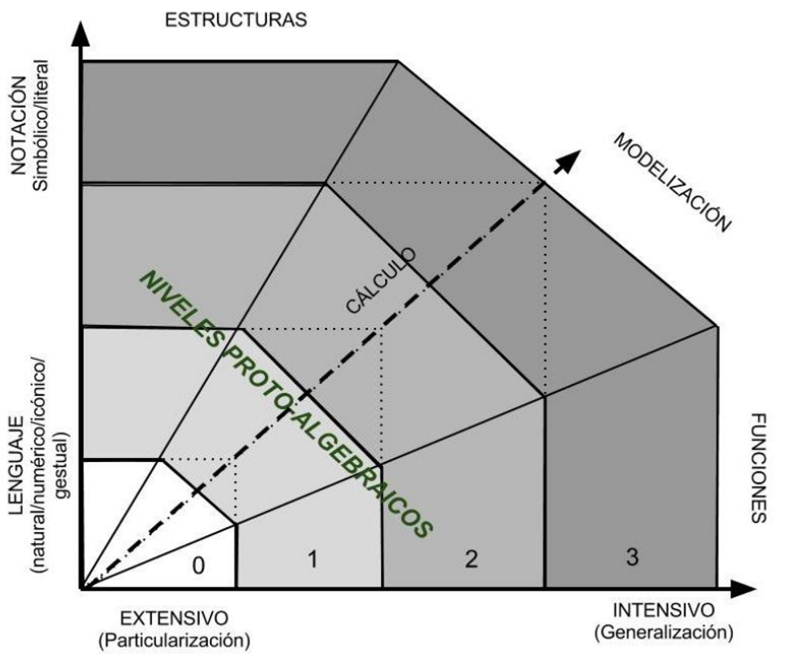

# Acceso a la presentación {data-background-image="assets/images/pc.jpg" data-background-opacity="0.25"}

## {data-background-image="assets/images/pc.jpg" data-background-opacity="0.18"}

{width=50%}

[https://pbeltran.github.io/unaempresadocente-videos](https://pbeltran.github.io/unaempresadocente-videos)

# ¿Por qué interesarnos en esto? {data-background-image="assets/images/videos1.jpg" data-background-opacity="0.18"}

##

- El fenómeno de los vídeos educativos alojados en plataformas en línea no es nuevo.
- YouTube™ es aceptado por los estudiantes como medio para el aprendizaje de las matemáticas (Ramírez, 2010). 
- Estos vídeos son un recurso muy utilizado en ciertas propuestas pedagógicas, como en el **flipped learning** (Davies, Dean, & Ball, 2013).

##

> Es necesario que las **didácticas específicas** indaguen sobre el grado de adecuación de estas propuestas de enseñanza-aprendizaje, asegurando de esta forma que la tecnología esté alineada con los objetivos de aprendizaje (Turney, Robinson, Lee, & Soutar, 2009)

# Un estudio sobre vídeos de YouTube {data-background-image="assets/images/videos1.jpg" data-background-opacity="0.18"}

##

Beltrán-Pellicer, P., Giacomone, B., & Burgos, M. (2018). Online educational videos according to specific didactics: the case of mathematics / Los vídeos educativos en línea desde las didácticas específicas: el caso de las matemáticas. _Cultura y Educación, 30_(4), 633-662. doi: 10.1080/11356405.2018.1524651.

[Enlace](https://www.tandfonline.com/eprint/r8gbHE2dM75Z3t3wdE7U/full) [Enlace a RG](https://www.researchgate.net/publication/328292739_Online_educational_videos_according_to_specific_didactics_the_case_of_mathematics_Los_Videos_educativos_en_linea_desde_las_didacticas_especificas_el_caso_de_las_matematicas/comments)

{width=50%}

## Objetivo del trabajo

En este estudio se describe y se interpreta la **faceta epistémica** de videos educativos en línea previamente seleccionados, teniendo como objetivo general valorar el grado de adecuación epistémica de los vídeos más vistos por los usuarios en YouTube™.

## Marco teórico y metodología

:::incremental
- **Metodología cualitativa**, de carácter interpretativo-valorativo.
- Herramientas teórico-metodológicas del **enfoque ontológico-semiótico del conocimiento y la instrucción matemáticos (EOS)** (Godino, Batanero, & Font, 2007).
:::

. . .

{width=90%}
[http://enfoqueontosemiotico.ugr.es](http://enfoqueontosemiotico.ugr.es/)

## Idoneidad didáctica

Grado en que un proceso de instrucción reúne ciertas características que permiten calificarlo como adecuado para la adaptación entre los significados personales obtenidos por los alumnos (aprendizaje) y los significados institucionales, ya sean pretendidos o implementados (enseñanza), considerando la influencia del entorno (Godino, 2013). 

## Idoneidad didáctica

{width=65%}

Fuente: Godino (2013).

## Criterios de idoneidad
:::incremental
- Para cada faceta Godino (2013) propone un sistema de criterios generales para que sean consideradas de calidad. 
- Breda, Pino-Fan, & Font (2017) señalan que estos criterios de idoneidad didáctica son potentes herramientas para organizar la reflexión y evaluación de un proceso de instrucción.
	- Es conveniente utilizarlos para analizar y valorar los vídeos de la muestra considerada. 
- Santos (2018) propone un modelo para valorar vídeos educativos de matemáticas:
	- Idoneidad didáctica (EOS).
	- Lógica difusa para considerar la evaluación mediante una opinión de las comunidades de interés
	- Métodos multicriterio (TOPSIS), para ordenar los datos obtenidos y tomar decisiones a partir de ellos.
:::

## Faceta epistémica

:::incremental
- La faceta epistémica se refiere, en términos de Breda et al., (2017) a la enseñanza de una buena matemática.
- La idoneidad epistémica se considera mayor en la medida que los contenidos pretendidos o implementados representan bien a los contenidos de referencia. Dos criterios fundamentales (Godino, 2013):
	- La presencia de diversos significados del contenido correspondiente y su interconexión.
	- El reconocimiento de la diversidad de objetos primarios y procesos implicados para los diversos significados.
:::

## Faceta epistémica

Las **situaciones-problemas** tienen un rol central en el EOS, de modo que los objetos matemáticos participan y emergen de los sistemas de prácticas matemáticas.

. . .

>Se trata de dar una respuesta satisfactoria a la cuestión del significado de los objetos matemáticos

:::incremental
- ¿Qué es la media?
- ¿Qué es el número?
:::

## Algunas referencias para profundizar

- Godino, J. D., Batanero, C. y Font, V. (2019). The onto-semiotic approach: implications for the prescriptive character of didactics. _For the Learning of Mathematics, 39_(1), 37- 42. [Enlace a la versión en español](http://enfoqueontosemiotico.ugr.es/documentos/Godino_Batanero_Font_2019_FLM_esp.pdf)
- [Juan D. Godino en 'Una empresa docente'](https://www.youtube.com/watch?v=dwSpPZjn0IM)
- [Vicenç Font en 'Una empresa docente'](https://www.youtube.com/watch?v=VolC5qpRB8k)

## Faceta epistémica

Bajo esta perspectiva ontosemiótica, la actividad matemática se puede describir y analizar a partir de una ontología explícita de objetos (Godino et al., 2007):

:::incremental
- **Lenguajes**: en sus diversos registros y representaciones, natural, gestual, simbólico, gráfico, etc..
- **Situaciones-problemas**: aplicaciones intra y extra-matemáticas, ejercicios, problemas.
- **Reglas**:
	- _Conceptos-definición_: conceptos introducidos mediante definiciones o descripciones, proporcionalidad, función, etc.
	- _Proposiciones_: enunciados sobre conceptos-definición.
	- _Procedimientos_: algoritmos, operaciones, técnicas de cálculo.
- **Argumentos**: enunciados usados para validar o explicar las proposiciones y procedimientos.
:::

## Objeto matemático de estudio {data-background-image="assets/images/student.jpg" data-background-opacity="0.1"}

>Repartos directamente proporcionales.

:::incremental
- Este tipo de situación-problema aparece en el primer ciclo de ESO en España, dentro del bloque dedicado a 'Números y álgebra' (LOMCE).
- Las concreciones curriculares autonómicas lo incluyen en 2º ESO (13-14 años).
- La proporcionalidad es un tema recurrente en los canales de YouTube™.
:::

## Niveles de algebrización

Modelo de razonamiento algebraico escolar (EOS):

- Niveles de algebrización de las prácticas matemáticas que se realizan al resolver tareas propias de Educación Primaria y Secundaria (Godino, Aké, Gonzato, & Wilhelmi, 2014; Godino, Neto, Wilhelmi, Aké, Etchegaray, & Lasa, 2015). 
- Se definen a partir de los tipos de representaciones usadas, los procesos de generalización implicados y el cálculo analítico que se pone en juego en la actividad matemática correspondiente (los tres primeros niveles que son suficientes para nuestro trabajo).

## Niveles de algebrización

{width=65%}

##

>Se trata de responder a la preguna de _qué es el álgebra_.

De hecho, es una cuestión de gran interés para la didáctica de la matemática que se trató en la última conferencia de _Una Empresa Docente_, de [Angel Alsina](https://www.youtube.com/watch?v=Iv5g46-bwaA).

## Muestra
:::::::::::::: {.columns}

::: {.column width="55%"}

:::incremental
- Una búsqueda por vídeos en YouTube™ con las palabras clave repartos proporcionales devuelve 1370 resultados. 
- Seleccionamos solamente aquellos con más de 1000 visitas.
- Se reduce el conjunto a 60 vídeos. De ellos, la mitad tratan exclusivamente repartos inversamente proporcionales o compuestos, de manera que la muestra final de estudio queda determinada por 31 vídeos.
:::

:::

::: {.column width="45%"}

{width=80%}

:::
::::::::::::::

# Resultados obtenidos {data-background-image="assets/images/analysis.jpg" data-background-opacity="0.18"}

## Niveles de algebrización

En relación con los niveles de algebrización, encontramos resoluciones:

1. Aritméticas
2. Proto-algebraicas: razones y proporciones
3. Proto-algebraicas: valor perdido
4. Algebraicas: símbolos analíticos sin aludir al contexto

## ¿Es mejor un nivel 4 que un 1?  {data-background-image="assets/images/student.jpg" data-background-opacity="0.1"}

Que sea de un nivel u otro no implica que sea ni mejor ni peor. Simplemente, que se ponen en juego objetos con **mayor o menor grado de abstracción**. En 2ºESO el análisis de la bibliografía revela consenso en un enfoque aritmético, con ciertas conexiones al álgebra.

En la muestra de 31 vídeos encontramos soluciones:

:::incremental

- Parte-todo (fracción como operador): 7 vídeos (23%).
- Reducción a la unidad: 6 vídeos (19%).
- Valor perdido: en 11 vídeos (35%).
- Ecuaciones basadas en _k_: 10 vídeos (32%)

:::

. . .

:::alert
_Los porcentajes no suman 100%. Hay vídeos que abordan más de un tipo de solución._
:::

## Registros y representaciones  {data-background-image="assets/images/language.jpg" data-background-opacity="0.1"}

{width=50%}

## Dos ejemplos {data-background-image="assets/images/language.jpg" data-background-opacity="0.1"}

:::::::::::::: {.columns}
::: {.column width="45%"}

Uso del del registro simbólico-algebraico propio de nivel 3. 

{width=90%}

:::

::: {.column width="45%"}

Ejemplo de representación diagramática.

{width=90%}

:::
::::::::::::::

## Llegados a este punto (niveles y lenguajes) {data-background-image="assets/images/language.jpg" data-background-opacity="0.1"}

:::incremental
- Un estudiante puede encontrarse con vídeos que aporten significados poco adecuados a su nivel o que incluso interfieran con el proceso de negociación que plantee su profesor de aula.
- Surge la necesidad de que sea su docente de referencia el que seleccione los vídeos. O la importancia de adquirir un sentido crítico. 
:::

## Analisis de las reglas

>Solo **uno de los vídeos de la muestra** aporta una definición correcta de la situación:

"Si una persona aporta el doble, le corresponde el doble en el reparto, etc."

. . .

>9 de los vídeos (29%) incurren en el error de definir este tipo de situación en términos aditivos, como aquella en la que el que 'más' aportó inicialmente, 'más' recibe: 

"Eso es reparto proporcional, entre que a más cooperes, mayor cantidad te tocará."

## Errores e impreciciones en las reglas

:::incremental
- Por tanto, se asume que es una situación de proporcionalidad, sin exigir una condición de regularidad. Se fomenta lo que algunos autores llaman la **ilusión de linealidad**.
- Hay muchos vídeos que ni identifican las magnitudes que intervienen ni sus unidades de medida.
- En 4 vídeos (13%) hay errores en el tratamiento de las operaciones aritméticas y/o de las expresiones algebraicas y en 5 de los vídeos (16%) se observan otras imprecisiones o errores.
:::

. . .

{width=70%}

## Argumentos

En cuanto a los argumentos. Muchos de los vídeos carecen de ellos. Y de los que hacen, por ejemplo, una comprobación, el argumento destinado a verificarla suele incluir una condición necesaria, pero no suficiente. 

>Volvemos al "a mayor... más...".

## Relaciones o conexiones entre los objetos matemáticos

Hay vídeos que no aportan significado, no hay relación alguna entre objetos.

:::incremental
- Únicamente 4 de los vídeos (13%) identifican y articulan los diversos significados de los objetos que intervienen.
- En 15 vídeos (48%) solamente se identifican a veces.
- En 12 vídeos (39%), el profesor no lo hace nunca.
:::

## La constante de proporcionalidad

El significado de $k$ es el que menos se identifica. Ciertos vídeos hacen uso de los literales $x$, $y$ o $z$, para simbolizar las cantidades desconocidas en el reparto, identifican a qué se refieren, pero posteriormente aparece $k$ y no se establece su significado.

## Valoración de la idoneidad

{width=80%}

Se puede acceder a los enlaces fácilmente desde el [artículo](https://www.tandfonline.com/eprint/r8gbHE2dM75Z3t3wdE7U/full).

## Limitaciones {data-background-image="assets/images/conclusiones.jpg" data-background-opacity="0.1"}

:::incremental
- Complejidad a la hora de cuantificar el grado de idoneidad epistémica de cada vídeo.
- La reducción a un simple número conlleva una pérdida de información. 
- En este trabajo se ha calculado el grado de idoneidad de forma similar a lo realizado por otros autores (Learning Mathematics for Teaching Project, 2011). 
:::

. . .

>Los valores obtenidos revelan una baja idoneidad epistémica, que concuerda con resultados de estudios similares para otros campos del conocimiento, como las ciencias experimentales y sociales (Bortoliero & León, 2017; Tan, 2013). 

# Dominio afectivo {data-background-image="assets/images/class.jpg" data-background-opacity="0.18"}

## La faceta afectiva

La faceta afectiva de un proceso de enseñanza y aprendizaje de las matemáticas es una de las complejas.

:::incremental
- Interacción con la faceta cognitiva.
- Objeto de investigación desde diferentes marcos teóricos. 
- Consenso en distinguir emociones, actitudes y creencias (McLeod, 1992). 
- Es habitual considerar también los valores (DeBellis y Goldin, 2006).
:::

## El dominio afectivo desde el EOS

Beltrán-Pellicer, P., Godino, J. D. (2019). An onto-semiotic approach to the analysis of the affective domain in mathematics education. _Cambridge Journal of Education_, 1-20. DOI: 10.1080/0305764X.2019.1623175

[Enlace](https://www.tandfonline.com/eprint/KimkMTSJt9uGibVg9Gej/full?target=10.1080/0305764X.2019.1623175) [Enlace a RG](https://www.researchgate.net/publication/333699589_An_onto-semiotic_approach_to_the_analysis_of_the_affective_domain_in_mathematics_education)

{width=40%}

## Visión de las matemáticas {data-background-image="assets/images/clase.jpg" data-background-opacity="0.1"}

- El proceso de enseñanza y aprendizaje es una negociación de significados. 
	- Significado personal.
	- Significado de referencia, institucional. 

>¿Qué visión de las matemáticas queremos transmitir?

## Creencias sobre la enseñanza de las matemáticas {data-background-image="assets/images/clase.jpg" data-background-opacity="0.1"}

Hay un consenso en que la resolución de problemas debería ser el eje central de la enseñanza y el aprendizaje de las matemáticas. Acerca de ello, hay que considerar tres perspectivas:

::: incremental

- Enseñar **para** resolver problemas. 
- Enseñar **a través** de la resolución de problemas. 
- Enseñar **sobre** resolución de problemas. 

:::

. . .

Para indagar un poquito sobre esto: [Gaulin \(2001\)](http://www.hezkuntza.ejgv.euskadi.eus/r43-573/es/contenidos/informacion/dia6_sigma/es_sigma/adjuntos/sigma_19/7_Tendencias_Actuales.pdf)

## A través de la resolución de problemas {data-background-image="assets/images/clase.jpg" data-background-opacity="0.1"}

>¿El objetivo general de usar la RP en el aula de matemáticas debería ser enseñar la RP per se, o enseñar contenido matemático, usando la RP como vehículo? 

:::incremental
- Autores como Anderson (2014) atribuyen el bajo desempeño en RP de los estudiantes al tratamiento _tradicional_ de la RP en el aula, independiente y aislado del desarrollo de ideas, procesos y conceptos matemáticos básicos. 
- La RP a menudo toma la forma de problemas de aplicación al final de cada lección, presumiblemente para promover la capacidad de **aplicar** lo aprendido. Así rara vez se cumple el propósito de enseñar a resolver problemas o desarrollar o profundizar el conocimiento de ese contenido (Anderson, 2014). 
:::

## A través de la resolución de problemas {data-background-image="assets/images/clase.jpg" data-background-opacity="0.1"}

:::incremental
- Pero la atención (limitada) de la investigación sobre cómo se puede lograr el desarrollo de los conceptos a través de la RP indica que a la RP no se le ha dado un papel central en el plan de estudios, sino que se ha llevado a la periferia (Rigelman, 2013). 
- Se necesitan más estudios que exploren si ambas metas pueden lograrse a la vez, examinando el impacto del desarrollo conceptual impulsado por problemas en el desarrollo de competencias para la resolución de problemas (Lester y Charles, 2003; Schoen y Charles, 2003). 
:::

## {data-background-image="assets/images/clase.jpg" data-background-opacity="0.1"}

>Si bien los estudios más recientes favorecen la RP como un medio para desarrollar la comprensión del contenido matemático en lugar de un fin en sí mismo, el debate está lejos de resolverse.

English, L. D., & Gainsburg, J. (2016). Problem Solving in a 21st-Century Mathematics Curriculum. En L. D. English, & D. Kirshner (Eds.), _Handbook of International Research in Mathematics Education_, pp. 313-335. Routledge.

## Una cita para reflexionar

{width=100%}

# Créditos y referencias {data-background-image="assets/images/credits.jpg" data-background-opacity="0.1"}

## Lista de referencias {data-background-image="assets/images/credits.jpg" data-background-opacity="0.1"}

Beltrán-Pellicer, P., Giacomone, B., & Burgos, M. (2018). Online educational videos according to specific didactics: the case of mathematics / Los vídeos educativos en línea desde las didácticas específicas: el caso de las matemáticas. _Cultura y Educación, 30_(4), 633-662. doi: 10.1080/11356405.2018.1524651. [Enlace](https://www.tandfonline.com/eprint/r8gbHE2dM75Z3t3wdE7U/full)

Beltrán-Pellicer, P., Godino, J. D. (2019). An onto-semiotic approach to the analysis of the affective domain in mathematics education. _Cambridge Journal of Education_, 1-20. DOI: 10.1080/0305764X.2019.1623175. [Enlace](https://www.tandfonline.com/eprint/KimkMTSJt9uGibVg9Gej/full?target=10.1080/0305764X.2019.1623175) 

## Créditos {data-background-image="assets/images/credits.jpg" data-background-opacity="0.1"}

_Compartir el conocimiento de forma libre es una buena práctica._

En estas diapositivas se han utilizado materiales disponibles en abierto y se han citado las fuentes correspondientes. El contenido de la presentación está publicado con licencia Creative Common [CC-BY-SA-4.0](https://creativecommons.org/licenses/by-sa/4.0/legalcode.es), lo que quiere decir que puedes compartirla y adaptarla, citándonos (Pablo Beltrán-Pellicer y José Mª Muñoz-Escolano) y poniendo un enlace a [https://pbeltran.github.io/unaempresadocente-videos/](https://pbeltran.github.io/unaempresadocente-videos/).

_Siéntete libre de trabajar con este material y de contactar conmigo para compartir tus reflexiones._

## {data-background-image="assets/images/credits.jpg" data-background-opacity="0.1"}

Presentación realizada con  <a href="https://revealjs.com/#/">Reveal.js</a>, <a href="https://pandoc.org/">Pandoc</a>, <a href="https://www.mathjax.org/">MathJax</a> y <a href="https://www.markdownguide.org/">Markdown</a>. El código fuente está disponible en [https://github.com/pbeltran/unaempresadocente-videos](https://github.com/pbeltran/unaempresadocente-videos)

La fuente de las imágenes es propia, salvo las que se ha citado la fuente en su diapositiva y las de dominio público obtenidas en [Unsplash](https://unsplash.com).

